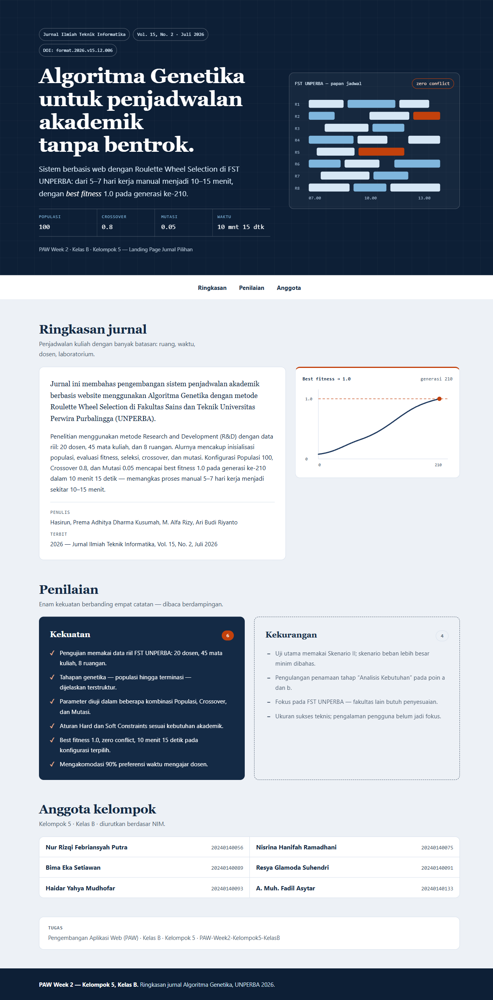
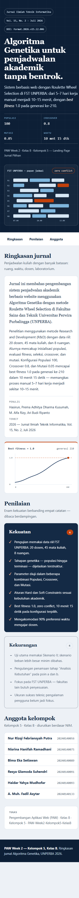

# PAW Week 2 — Kelompok 5 Kelas B

Landing page ringkasan jurnal: **Implementasi Algoritma Genetika untuk Otomatisasi Penjadwalan Akademik Guna Menghindari Conflict of Schedule**.

Branch: `yuum` — redesain editorial akademik, mobile-first responsif (ikut panduan `impeccable` register brand + adapt).

## Tampilan

### Desktop (1280px)



### Mobile (390px)



## Konsep redesain

- **Suara merek:** tertib, mekanis, kertas-kampus — acuannya papan jadwal lab / print-out timetable, bukan template SaaS.
- **Warna committed:** hero navy pekat (`#0d1f36`) dengan pola garis timetable samar + satu aksen cap orange (`#c2410c`). Netral tint-biru, bukan krem.
- **Tipografi:** Georgia serif untuk display + sans sistem untuk isi + mono hanya untuk data (chip jurnal, parameter, NIM). Tanpa font eksternal.
- **Imagery tanpa aset:** dua SVG inline — papan jadwal 8 ruangan (zero conflict) di hero + kurva fitness → 1.0 di generasi 210.
- **Anti AI slop:** tanpa gradient-text, glassmorphism, side-stripe, eyebrow per-section, hero-metric raksasa, atau kartu kembar — Kekuatan (panel navy solid) vs Kekurangan (outline putus-putus) diberi perlakuan beda.
- **Mobile-first:** 1 kolom di 320px+, `min-width: 640px` tablet, `min-width: 1024px` desktop (hero split + versus berdampingan + ledger 2 kolom). Nav geser di ponsel, target sentuh 44px, safe-area, `prefers-reduced-motion`, satu-satunya animasi hanya saat hero dimuat.

## Verifikasi

- Playwright: 390px dan 768px tanpa horizontal overflow, 0 console error.

## Cara lihat

```bash
git checkout yuum
python -m http.server 8124
# buka http://localhost:8124/index.html
```
